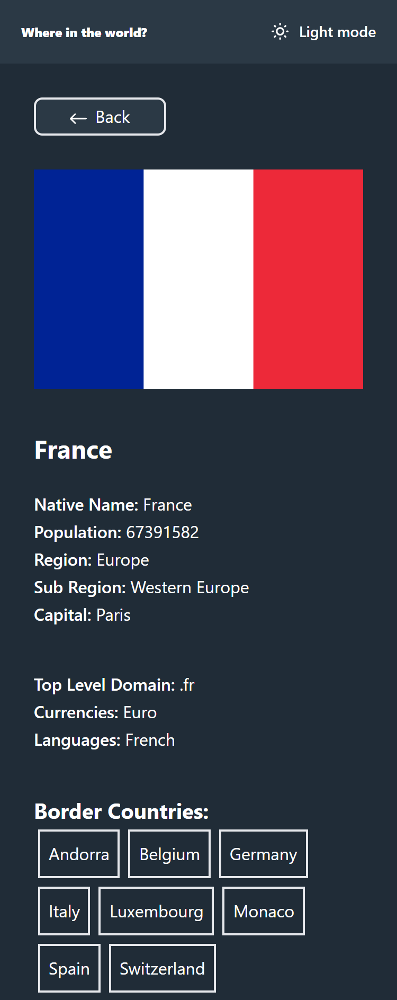
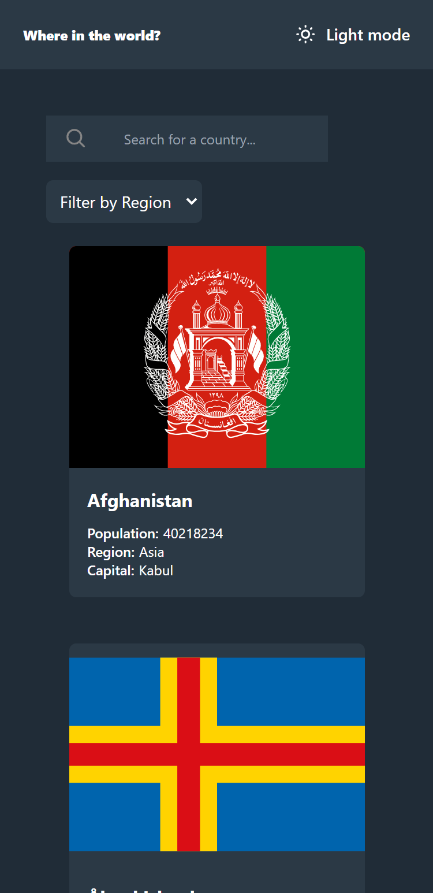
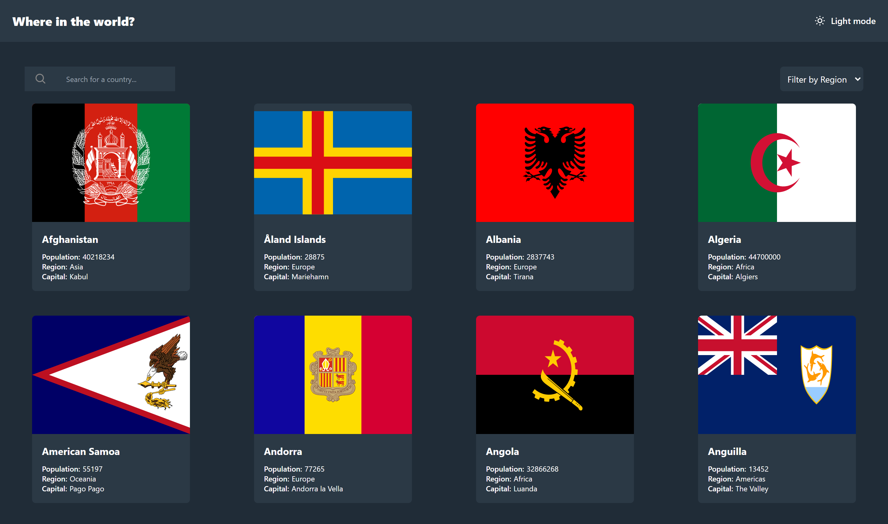
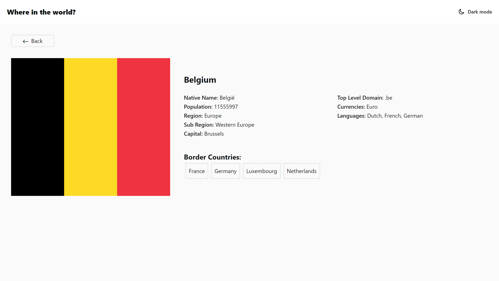

# Frontend Mentor - REST Countries API with color theme switcher solution

This is a solution to the [REST Countries API with color theme switcher challenge on Frontend Mentor](https://www.frontendmentor.io/challenges/rest-countries-api-with-color-theme-switcher-5cacc469fec04111f7b848ca). Frontend Mentor challenges help you improve your coding skills by building realistic projects. 

## Overview

### The challenge

Users should be able to:

- See all countries from the API on the homepage
- Search for a country using an `input` field
- Filter countries by region
- Click on a country to see more detailed information on a separate page
- Click through to the border countries on the detail page
- Toggle the color scheme between light and dark mode *(optional)*

### Screenshots

Mobile Details page

Mobile Home page

Desktop Home page

Desktop Details page

### Links

- Solution URL: [https://www.frontendmentor.io/solutions/country-api-react-tailwind-dUNZhveVaL](https://www.frontendmentor.io/solutions/country-api-react-tailwind-dUNZhveVaL)
- Live Site URL: [https://dev-paull.github.io/countries-api-vite-react/](https://dev-paull.github.io/countries-api-vite-react/)

## My process

- 🔎 Analyzed the screenshots to identify the different pages, components and features.
- ✍️ Wrote down everything I thought I would need to learn to complete this challenge. *(This includes almost everything about React **since it's my first project with it**, but I knew I would need state, context, router, creating components & something to fetch my data)*
- 📄 Read a lot of documentation about different methods and videos/guides to have multiple explanations.
- 🏠 Built the Homepage, then extracted the components such as header, search bar, region selector, country cards. I started by using a small sample of fake content, then installed **axios** to fetch the data from my json file.
- 📄 Built the Country page, then installed **react-router-dom** to create a router and define my paths.
- 💻 Styled the desktop-version
- 🌗 Implemented the dark-mode/light-mode feature with a theme context provider & **useContext** hook.
- ⚙️ Installed **gh-pages** and set up the config files so that the app can be built and deployed to Github Pages.
- 🪳 Debugged and tested on multiple devices to make sure the features are available.

#### Updates

- ➕ Added `CountriesContext` to share all the data between pages and components.
- 🧹 Cleaned up my code by extracting more components and functions to sorted separate files.
- 👉 Coming soon: Better UI and animations
### What I learned

- React: Component creation, state management with `useState`, `useEffect`, `useMemo`
- Context: Creating and using context providers to manage global state.
- Routing: Setting up and managing routes with `react-router-dom`.
- Data Fetching: Using `axios` to fetch data from an API or local JSON file.
- Styling: Applying styles for different screen sizes and implementing themes with **TailwindCSS**.
- Dark Mode: Managing themes with context and conditional styling.
- Deployment: Building and deploying a React application to GitHub Pages.
- Testing and Debugging: Ensuring cross-device compatibility and fixing bugs.

I also read about `useMemo` and `useCallback`, Tanstack (react query), data pagination, local storage, redux. 

I plan on diving deeper into useMemo and useCallback, React Query, component structure, error handling, custom hooks, Redux, Suspense mode and accessibility.

**Any feedback welcome**

